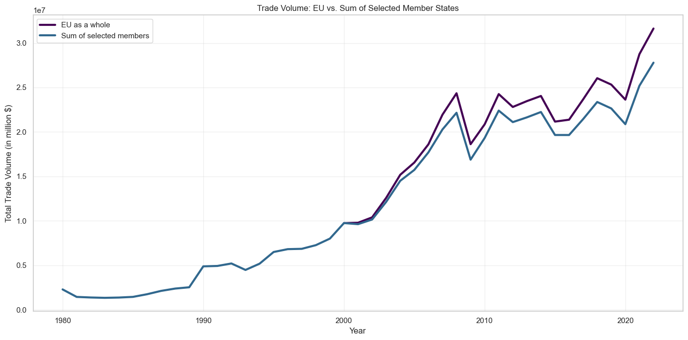

# 🌐 Navigating Global Trade: An Analysis of Imports and Exports from 1980 to 2022

## 📊 Table of Contents
- [Project Overview](#-project-overview)
- [Key Insights](#-key-insights)
- [Data Analysis](#-data-analysis)
- [Conclusions](#-Insights)
- [Tools Used](#-tools-used)
- [How to Use](#-how-to-use)
- [Contributing](#-contributing)
- [License](#-license)

## 🌍 Project Overview

This project delves into the intricate world of global trade, analyzing import and export data from 1980 to 2022. By examining trade balances, product trends, and the impact of major economic events, we aim to uncover patterns and insights that shape the global economy.

## 💡 Key Insights

1. **Trade Balance Shifts**: China showed the most significant positive shift, while the US experienced the largest negative shift.
2. **Product Trends**: Clothing and textiles demonstrated positive trends, while machinery and electronics faced challenges.
3. **2008 Financial Crisis Impact**: Varied effects on different countries, highlighting the importance of diverse economic strategies.
4. **Special Economic Zones**: Maintained consistent importance in global trade throughout the study period.
5. **EU Trade Dynamics**: The EU as a whole showed higher trade volumes compared to the sum of individual member states.

## 📈 Data Analysis

Our analysis covered a wide range of questions, each providing unique insights into global trade dynamics:

1. **Top Traders**
   - Question: What are the top 10 countries with the highest trade surpluses and deficits for each year?
   - Result: 
    

2. **Trade Balance Evolution**
   - Question: How have the trade balances of major trading nations evolved from 1980 to 2022?
   - Result:
    

3. **Product Category Contribution**
   - Question: Which product categories contribute most to trade surpluses or deficits for different countries?
   - Result:
    

4. **Export Composition Changes**
   - Question: How has the composition of exports and imports (by product categories) changed for individual countries over the years?
   - Result:
    

5. **Trade Balance Shifts**
   - Question: Which countries have shown the most significant shifts in their trade balance over time, and in which product categories?
   - Result:
    

6. **Consistent Trade Patterns**
   - Question: Are there any countries that have consistently maintained trade surpluses or deficits across all product categories?
   - Result:  Chad is the only country with continuous trade deficit 

7. **Product-Specific Trade Balances**
   - Question: How do trade balances vary across different product categories for India?
   - Result:
    

8. **Trade Portfolio Diversity**
   - Question: Which countries have the most diverse export and import portfolios, and how has this impacted their overall trade balance?
   - Result:

    | Country          | Export Diversity | Import Diversity | Trade Balance      |
    |------------------|------------------|------------------|--------------------|
    | Tuvalu           | 1.000000         | 0.710803         | -8.833333          |
    | Chad             | 1.000000         | 0.000000         | -2.000000          |
    | Georgia          | 0.861822         | 0.862790         | -7443.777778       |
    | Kyrgyz Republic  | 0.851002         | 0.852265         | -5244.920000       |
    | Lithuania        | 0.846665         | 0.846959         | -8522.266667       |
    | Belarus          | 0.841918         | 0.851022         | -8839.851852       |
    | Viet Nam         | 0.835485         | 0.827819         | 1517.769231        |
    | Malaysia         | 0.834898         | 0.791928         | 56922.255814       |
    | Greece           | 0.832859         | 0.805778         | -48152.209302      |
    | Bulgaria         | 0.829507         | 0.832954         | -11806.033333      |

9. **2008 Financial Crisis Impact**
   - Question: How did major global events (e.g., 2008 financial crisis) impact trade balances for different countries?
   - Result:
    

10. **Product Category Trends**
    - Question: Are there any noticeable trends in trade balances for specific product categories across multiple countries?
   - Result:
    

11. **Special Administrative Regions**
    - Question: How do trade patterns of special administrative regions (e.g., Hong Kong, Macau) compare in terms of volume and product mix?
   - Result:
    
    

12. **Geopolitical Changes Impact**
    - Question: What were the trade volumes of entities before and after major geopolitical changes?
   - Result:
    

13. **Economic Unions vs Member States**
    - Question: How have trade patterns evolved for economic unions like the EU compared to individual member states?
   - Result:
    

14. **Overseas Territories vs Sovereign Nations**
    - Question: Do overseas territories show distinct trade patterns compared to sovereign nations?
   - Result:
    

15. **Special Economic Zones Importance**
    - Question: How has the relative importance of special economic zones in global trade changed over time?
   - Result: Changes post Euro currency acceptance in new countries is tremendous
    

16. **Countries vs Special Entities Product Comparison**
    - Question: How do the types and volumes of products traded by countries compare to those of special entities?
   - Result:
    

17. **Growth Rate Comparison**
    - Question: Are there significant differences in the trade volume growth rates between countries and special entities?
   - Result:
    

18. **Top Global Exporters**
    - Question: Who are the top 10 exporters by value overall?
   - Result:
    

19. **Top Global Importers**
    - Question: Who are the top 10 importers by value overall?
   - Result:
    

20. **Textile Trade Leaders**
    - Question: Who are the top 5 importers and exporters of textiles?
   - Result:
    

## 🎯 Insights

- Trade Balance Trends:

    - China has shown the most significant positive shift in trade balance from 1980-1990 to 2012-2022.
    - The United States has experienced the largest negative shift in trade balance during the same period.

- Product Category Trends:

    - Clothing and textiles have shown the most positive trade balance trends globally.
    - Machinery and transport equipment, manufactures, and office and telecom equipment have shown the most negative trade balance trends.

- Impact of 2008 Financial Crisis:

    - The United States and China showed the most improved trade balances after the 2008 financial crisis.
    - Japan, Brazil, and France experienced the most significant worsening of trade balances post-crisis.

- Special Administrative Regions:

    - Hong Kong and Macau show distinct trade patterns compared to sovereign nations, with higher trade volumes relative to their size.

- European Union Trade:

    - The EU as a whole shows higher trade volumes compared to the sum of selected member states, indicating the impact of economic integration.

## 🛠 Tools Used

- Python
- Pandas
- Matplotlib
- Seaborn
- NumPy

## 🚀 How to Use

1. Clone this repository
2. Run the Jupyter notebook: `jupyter notebook Global_Trade_Analysis.ipynb`

## 👥 Contributing

Contributions to this project are welcome! Please fork the repository and submit a pull request with your suggested changes.

## 📄 License

This project is licensed under the MIT License - see the [LICENSE.md](LICENSE.md) file for details.

---

Created with Passion by Kvs